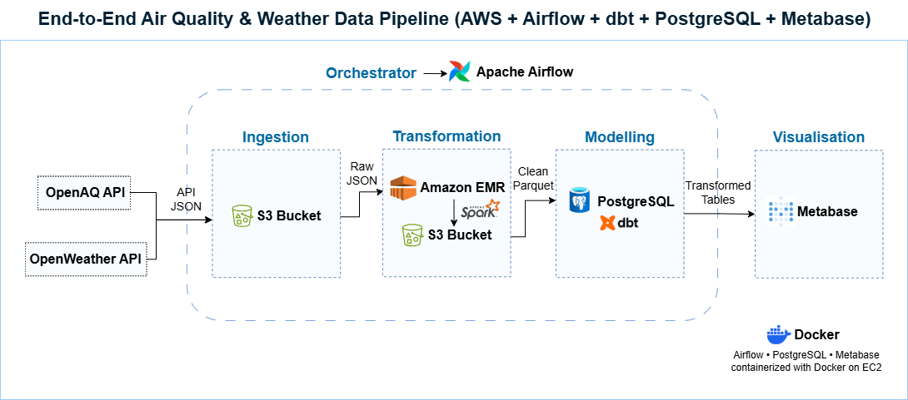
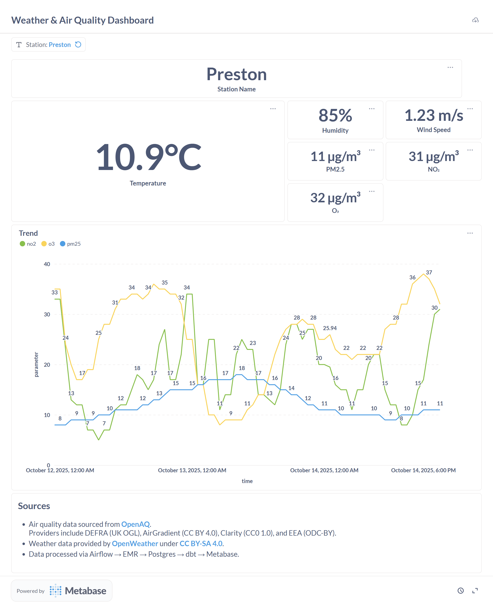
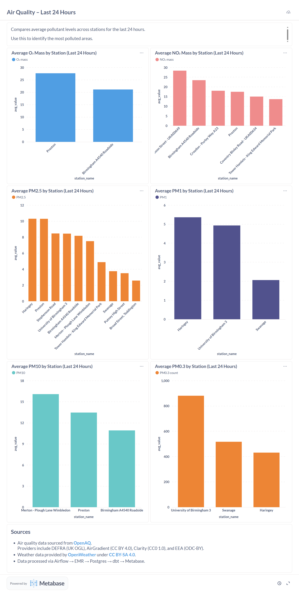
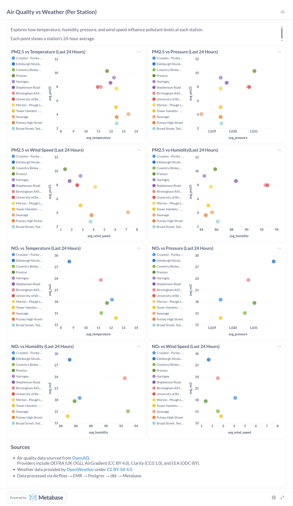
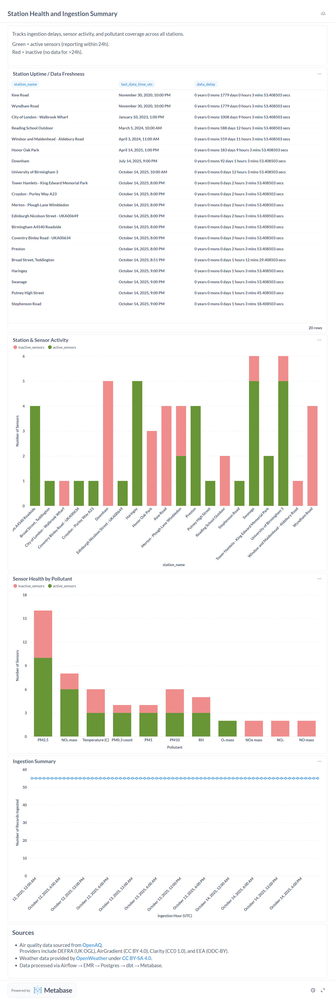

# End-to-End Air Quality and Weather Data Pipeline  
**(AWS | Airflow | Spark (EMR) | PostgreSQL | dbt | Metabase | Docker)**

---

## 1. Project Overview

This project demonstrates an automated **end-to-end data engineering pipeline** that collects, processes, models, and visualizes real-time air quality and weather data for stations across the United Kingdom.

It is designed to **mimic real-world enterprise data infrastructure** while remaining cost-efficient.  
Each technology was intentionally selected to reflect modern industry practices used in production data platforms.

---

## 2. Key Objectives

- Build a **fully orchestrated data pipeline** using Airflow, Spark, dbt, and PostgreSQL.  
- Demonstrate a **realistic multi-hop architecture** similar to enterprise-grade systems.  
- Optimize for **cost and simplicity** using a single EC2 instance and lightweight AWS resources.  
- Automate hourly data ingestion, transformation, and modeling.  
- Deliver **business-ready dashboards** through Metabase for analytics and monitoring.  

---

## 3. Architecture Overview


> *Logos are trademarks of their respective owners and are used here for illustrative purposes only.  
This project is for educational and portfolio demonstration purposes and is not affiliated with or endorsed by any of the mentioned entities.*


#### **End-to-end flow**

1. **Ingestion:**  
   Airflow fetches hourly air quality data from **OpenAQ API** and weather data from **OpenWeather API**, saving the raw JSON files in Amazon S3.  

2. **Transformation (Staging):**  
   A **Spark job running on AWS EMR Serverless** standardizes and merges the data into Parquet format, creating a structured dataset in S3.  

3. **Loading:**  
   Processed Parquet data is loaded from S3 into **PostgreSQL** using `awswrangler`, serving as the analytics warehouse.  

4. **Modeling:**  
   **dbt** transforms the warehouse data into a **star schema** composed of fact and dimension tables for flexible analytics.  

5. **Visualization:**  
   **Metabase** connects directly to PostgreSQL and presents dashboards for weather-air quality correlation, data freshness, and station health.  

6. **Orchestration:**  
   **Apache Airflow** coordinates all stages through chained DAGs and manages dependencies.  

7. **Deployment:**  
   All components (Airflow, PostgreSQL, Metabase) are containerized with **Docker** and deployed on a **single AWS EC2 instance** to minimize cost.

---

## 4. Design Rationale

This project is intentionally overbuilt for its data size because it aims to **simulate enterprise-grade data architecture**.  
Each component was chosen to balance **realism and cost control**.

| Component | Purpose | Reason for Choice |
|------------|----------|------------------|
| **AWS S3** | Central data lake for raw and transformed data | Simulates production data zones (raw, staging, curated) |
| **AWS EMR (Spark)** | Distributed transformation | Mimics big data environments while remaining cost-effective |
| **PostgreSQL** | Analytical warehouse | Lightweight substitute for Redshift or Snowflake |
| **dbt** | Modular transformations and testing | Reflects modern ELT workflows |
| **Airflow** | Scheduling and orchestration | Industry standard for DAG-based automation |
| **Metabase** | BI visualization | Free and self-hosted tool for interactive dashboards |
| **EC2 (Single Instance)** | Host for containers | Reduces cost while still providing full stack deployment |

**Why the multi-hop design?**  
The multiple hops (API → S3 → EMR → PostgreSQL → dbt → Metabase) mirror how data travels in enterprise ecosystems.  
This design encourages modularity, testing, and observability at each stage while maintaining a clear lineage.

---

## 5. Repository Structure


```
air-quality-data-pipeline/
│
├── .github/
│ └── workflows/
│ └── deploy-to-s3.yml   # CI/CD workflow deploying Spark jobs to S3
│
├── dags/   # Airflow DAGs for orchestration and dbt project integration
│ ├── airquality_dbt/   # Embedded dbt project inside Airflow
│ │ └── models/
│ │   ├── base/
│ │   │ ├── base_air_quality.sql   # Base staging model
│ │   │ └── schema.yml   # dbt model metadata and tests
│ │   └── marts/   # Dimensional and fact models
│ │     ├── dim_sensor.sql   # Sensor dimension
│ │     ├── dim_station.sql   # Station dimension
│ │     ├── fact_air_quality.sql   # Fact table combining air quality & weather
│ │     └── schema.yml
│ │
│ ├── ingestion_dag.py   # DAG fetching data from OpenAQ/OpenWeather APIs
│ ├── ingestion.py   # Python ingestion script for API calls and uploads to S3
│ ├── load_staging_to_postgres.py  # Loads transformed data from S3 into PostgreSQL
│ ├── run_dbt_models.py   # Executes dbt transformations and tests
│ └── transform_air_quality_data.py   # Launches Spark (EMR) transformations
│
├── scripts/   # Utility and helper scripts
│ └── generate_stations_sample.py   # Generates random UK monitoring stations sample
│
├── spark_jobs/   # Spark scripts for large-scale transformations
│ └── transform_raw_to_parquet.py   # Cleans, flattens, and enriches raw JSON data
│
├── .env.example   # Environment variable configuration template
├── .gitignore   # Files and directories to exclude from version control
├── docker-compose.yml   # Docker setup for Airflow, PostgreSQL, and Metabase
├── LICENSE   # License file
└── README.md  # Project documentation
```

---

## 6. Data Pipeline Flow

| Stage | Airflow DAG | Description |
|--------|-------------|-------------|
| **1. Ingestion** | `api_ingestion` | Fetches data hourly from OpenAQ and OpenWeather APIs, writes JSON to S3. |
| **2. Transformation** | `transform_air_quality_data` | Launches Spark on EMR to process raw JSON into Parquet format. |
| **3. Load** | `load_staging_to_postgres` | Reads Parquet files from S3 and appends to PostgreSQL staging tables. |
| **4. Modeling** | `run_dbt_models` | Runs dbt transformations to create star schema and perform data tests. |
| **5. Visualization** | (Metabase dashboard) | Connects to PostgreSQL for BI and data validation. |

All DAGs are **interconnected**: ingestion triggers transformation, which triggers loading, then dbt runs automatically.

---

## 7. Data Model


**Warehouse schema**
- `fact_air_quality`: Fact table containing hourly measurements of pollutants and weather.  
- `dim_station`: Station metadata such as location and coordinates.  
- `dim_sensor`: Sensor and pollutant attributes with measurement units.  

This structure enables flexible querying for time-based, pollutant-based, or geographic analysis.

---

## 8. Dashboards

### 1. Weather and Air Quality Dashboard  
Monitors real-time station-level conditions.



### 2. Air Quality - Last 24 Hours  
Compares pollutant concentrations across stations.



### 3. Air Quality vs Weather Correlation  
Explores relationships between environmental factors and pollutant levels.



### 4. Station Health and Ingestion Summary  
Shows ingestion delays, active sensors, and data freshness.



---

## 9. Setup and Deployment

### Prerequisites
- AWS account with S3, EMR Serverless, and EC2 access  
- Docker and Docker Compose  
- OpenAQ and OpenWeather API keys  
- Environment file based on `.env.example`

### Steps

1. **Clone repository**
   ```
   git clone https://github.com/Abimola/air-quality-data-pipeline.git
   cd air-quality-data-pipeline
   ```
2. **Set environment variables**
    ```
    cp .env.example .env

    ```
    Update the file with your credentials and keys.

3. **Launch local services**
    ```
    docker-compose up -d
    ```

    This starts Airflow, PostgreSQL, and Metabase containers.

4. **Upload sample stations to S3**
    ```
    python scripts/generate_stations_sample.py
    ```

5. **Trigger the Airflow DAGs**

  - Start with api_ingestion
  - The remaining DAGs execute automatically in sequence

6. **Access dashboards**

  - **Airflow UI:** `http://<EC2_PUBLIC_IP>:8080`  
  - **Metabase:** `http://<EC2_PUBLIC_IP>:3000`

  If you are testing locally (for example using Docker Desktop), you can still use:

  - **Airflow UI:** `http://localhost:8080`
  - **Metabase:** `http://localhost:3000`

---


## 10. Cost Optimization Notes

- **Single EC2 instance** hosts all services to minimize AWS charges.  
- **EMR Serverless** is used with minimal executors and runs only during transformation tasks.  
- **S3 storage** is small due to hourly sampling and limited retention.  
- **Metabase** and **Airflow** run in Docker containers for efficient resource sharing.  

This setup achieves **enterprise architecture realism** at very low monthly cost.

---

## 11. Data Sources and Licensing

- **Air quality data** sourced from [OpenAQ](https://openaq.org).  
  Providers include:
  - **DEFRA (UK)** under the [Open Government Licence v2.0](https://www.nationalarchives.gov.uk/doc/open-government-licence/version/2/),
  - **AirGradient** under [CC BY 4.0](https://creativecommons.org/licenses/by/4.0/),
  - **Clarity** under [CC0 1.0](https://creativecommons.org/publicdomain/zero/1.0/deed.ca),
  - **EEA** under [ODC-BY 1.0](https://opendatacommons.org/licenses/by/1-0/).  
- **Weather data** provided by [OpenWeather](https://openweathermap.org/) under [CC BY-SA 4.0](https://creativecommons.org/licenses/by-sa/4.0/).  
- **Pipeline processing** performed via *Airflow → EMR → PostgreSQL → dbt → Metabase*.

---

## 12. Key Learnings

- Integrating multiple AWS components in a cost-aware production-style setup.  
- Managing Airflow DAG dependencies and parameter passing across stages.  
- Implementing modular dbt transformations and incremental models.  
- Structuring pipelines for clarity, observability, and scalability.  
- Designing BI dashboards that link environmental data with weather indicators.

---

## 13. Future Enhancements

- Add data quality checks and freshness alerts through dbt or Great Expectations.  
- Introduce CI/CD for automated DAG deployment.  
- Implement metadata tracking and lineage monitoring.  
- Extend to multi-country coverage or streaming ingestion.

---

## 14. Results

- Automated pipeline from API to dashboard with minimal manual intervention.  
- Hourly ingestion and near real-time dashboard updates.  
- Complete data lineage through Airflow and dbt.  
- Architecture representative of modern cloud data engineering.

---

**Author:** Abimola Onibi  
**LinkedIn:** [linkedin.com/in/abimola-onibi](https://www.linkedin.com/in/abimola-onibi/)  
**GitHub:** [github.com/Abimola](https://github.com/Abimola)
